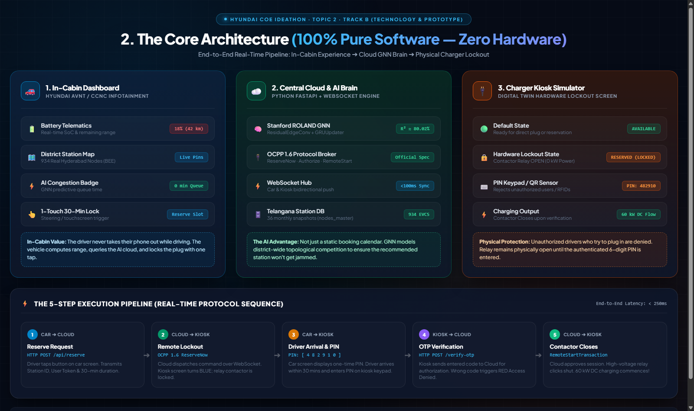

# Hyundai SmartReserve

[](https://hcoe-ideathon.com/)
[](https://hcoe-ideathon.com/)
[](https://hcoe-ideathon.com/)
[](https://python.org)
[](https://fastapi.tiangolo.com)
[](https://pytorch.org)
[](https://openchargealliance.org/)

An in-cabin EV charging assistant for Hyundai's ccNC / AVNT infotainment system.
It predicts congestion at charging stations with a spatio-temporal graph neural
network and lets the driver reserve a connector for 30 minutes with a single tap.
The reservation is carried to the charger over OCPP 1.6J and protected by a
one-time PIN.

Built for the Hyundai Centre of Excellence Mobility Innovation Ideathon 2026
(Track B, Category 2). The prototype is entirely software: the vehicle display and
the charger are both simulated and talk to a real backend over WebSockets.



---

## Problem

Public charging in India has a reliability problem that range alone does not solve.

- Existing apps (ChargeZone, Statiq, EVselect) list stations but, in our testing,
  do not report whether a specific connector is free right now. `[TODO: add your
  test date and method, or soften this sentence]`
- Checking a phone mid-drive is unsafe and illegal in most cases.
- A free charger is not a guaranteed charger. Another EV can take the connector
  during the drive, and ICE vehicles frequently block bays.
- Telangana's EV fleet is growing quickly (`[TODO: cite figure and source]`), so
  contention at popular hubs will get worse before it gets better.

## Solution

SmartReserve moves the whole decision into the car's native interface.

1. **Trigger.** When state of charge drops below 20%, the system queries the
   congestion model and surfaces the least busy hub along the route.
2. **Reserve.** One tap on the dashboard sends a reservation request to the cloud
   service, which issues an OCPP 1.6 `ReserveNow` to the target charge point for a
   30-minute window.
3. **Lock.** The charge point enters the Reserved state. In our simulator the
   contactor stays open (0 kW) until an authorized session starts.
4. **Authorize.** The backend issues a 6-digit PIN to the driver. Entering any
   other code on the charger is rejected. The correct PIN closes the contactor and
   DC fast charging begins.

Note on enforcement: `ReserveNow` is a request, and the charge point firmware is
what actually refuses other users. A production deployment would depend on
chargers implementing the OCPP Reservation feature profile. The simulator models
that behavior; it does not claim to prove it on real hardware.

---

## Datasets

| Dataset | Source | Scale | Used for |
| :--- | :--- | :--- | :--- |
| EV charging station registry | Bureau of Energy Efficiency, Ministry of Power (via Dataful, order #23369) | 934 stations across 33 districts of Telangana | Coordinates, power rating, connector types (CCS2, CHAdeMO, Type 2), port count, operator |
| EV and hybrid vehicle registrations | Parivahan Sewa, MoRTH (via Dataful, dataset #23540) | Monthly, RTO level, 2014 to 2026 | EV adoption volume, manufacturer split, BEV vs. hybrid, district growth rate |
| Points of interest | OpenStreetMap, Overpass API | Radius counts around each station | Nearby malls, fuel stations, tourism sites, hospitals, schools |
| District demographics | Census of India, Telangana State Portal | District and mandal level | Population density per district |
| Monthly graph snapshots | Derived from the sources above | 36 snapshots, Jan 2023 to Dec 2025 | Model input (see below) |

**About the snapshots.** Each snapshot is a graph whose nodes are stations with a
52-dimensional feature vector. Features include commissioning status (355 active
nodes in Jan 2023, growing to 934 in Dec 2025), demand lags at t-1, t-2 and t-3,
and sine/cosine month encodings.
`[TODO: state clearly how the demand targets (energy in kWh, peak load in kW) were
obtained. If they are modeled or synthesized from registration and POI data rather
than measured from charger logs, say so here.]`

---

## Demand Forecasting Model

The forecaster adapts **ROLAND** (You, Du and Leskovec, "ROLAND: Graph Learning
Framework for Dynamic Graphs", KDD 2022), which turns a static GNN into a dynamic
one by adding recurrent state across snapshots. The original implementation is
from the Stanford SNAP group; our model is a smaller reimplementation in PyTorch
fitted to this problem. `[TODO: link the ROLAND repo and note any code you reused.]`

```
        District subgraphs (934 nodes)
                       |
                       v
       +-------------------------------+
       | Spatial encoder               |   residual EdgeConv message passing
       +---------------+---------------+
                       | X_t
                       v
       +-------------------------------+
       | Temporal update               |   GRU cell with active-node mask
       +---------------+---------------+
                       | H_t
                       v
       +-------------------------------+
       | Regression head (MLP)         |   energy (kWh) and peak load (kW)
       +-------------------------------+
```

Design decisions:

- **Active-node masking.** Stations that are not yet commissioned in a given month
  keep their scaled-zero feature value (`-mean/std`) and are excluded from the
  update, so the model does not learn from stations that did not exist.
- **District-level subgraphs.** Stations in the same district form a complete
  subgraph. This models local competition for demand and prevents information
  from leaking across district borders.
- **Masked coordinates.** Latitude and longitude are zeroed in the input
  (`x[:, 0:2] = 0.0`) so the model learns from graph structure and temporal
  behavior instead of memorizing locations.

**Results.** Test R² is **80.02%** on a temporal holdout of snapshots 32 to 36
(`[TODO: confirm which of 78.50% or 80.02% is your final reported number and
which target it refers to; report per-target R², MAE and a baseline such as
last-month persistence or gradient boosting]`). The holdout is five snapshots, so
treat the figure as indicative rather than conclusive.

Checkpoints:
[`roland_final_weights_80_02.pt`](EVCS_Demand_Forecasting/final_model/roland_final_weights_80_02.pt),
[`roland_final_submission_80_02.pt`](EVCS_Demand_Forecasting/final_model/roland_final_submission_80_02.pt)

---

## Prototype Components

### In-cabin dashboard
`smartreserve/smartreserve_frontend/car_dashboard/index.html`

Styled after the 12.3-inch ccNC display. It renders a Leaflet map with all 934
stations, live battery and range telemetry, congestion badges from the model, a
reservation drawer with a countdown timer, the PIN display, and a Canvas chart of
the charging curve.

### Charger kiosk simulator
`smartreserve/smartreserve_frontend/kiosk_simulator/index.html`

A digital twin of a 60 kW DC charge point. States:
`AVAILABLE` to `RESERVED` to `ACCESS DENIED` (on a wrong PIN) to `CHARGING` to
`FINISHING`. It shows the contactor state (open at 0 kW, closed at 60 kW), a
touch keypad, a lockout after repeated bad attempts, an idle-fee countdown to
discourage bay hogging, and a live log of OCPP 1.6J frames.

### Backend
`smartreserve/smartreserve_backend/main.py`

An asynchronous FastAPI service with WebSocket channels to the vehicle and the
charger. It implements the OCPP 1.6J messages `ReserveNow`, `Authorize`,
`RemoteStartTransaction` and `MeterValues`, and serves congestion predictions. If
the model fails to load, a deterministic fallback predictor keeps the demo running.
`[TODO: add measured end-to-end latency and how you measured it; the earlier
"under 100 ms" claim needs a number behind it.]`

---

## Quick Start

```bash
git clone https://github.com/kushagrakushwah/Hyundai_vrum.git
cd Hyundai_vrum
pip install -r smartreserve/requirements.txt
python smartreserve/run_demo.py
```

Open two browser windows side by side:

| Window | URL |
| :--- | :--- |
| Vehicle dashboard | http://localhost:3000/car |
| Charger kiosk | http://localhost:3000/kiosk?station=TG0001 |
| Demo hub | http://localhost:3000 |
| API docs | http://localhost:8000/docs |

## Demo Walkthrough (about 90 seconds)

1. Arrange `/car` on the left and `/kiosk` on the right.
2. The car is at 18% state of charge. The model has already recommended the
   Gachibowli hub with no predicted queue.
3. Click **Reserve 30-Min Exclusive Slot** on the car screen.
4. The kiosk turns blue and shows `RESERVED, POWER LOCKED: 0 kW`.
5. Enter `111111` on the kiosk keypad. The screen flashes red with
   `ACCESS DENIED` and the contactor stays open.
6. Enter the PIN shown on the car dashboard (`482910` in the demo). The contactor
   closes, the kiosk turns green, and 60 kW charging starts with live curves on
   both screens.

---

## Security Considerations

- PINs are single-use, bound to one reservation and one connector, and expire with
  the 30-minute window.
- The kiosk locks out after repeated failed attempts.
- The demo PIN is hardcoded for reproducibility. In production it would be
  generated per reservation and mapped to an OCPP `idTag`.
- `[TODO: describe transport security. Real OCPP deployments use TLS (OCPP
  Security Profile 2 or 3). State what the prototype does today.]`

## Limitations and Future Work

- The charger is simulated. Real chargers vary in how fully they implement the
  OCPP Reservation profile, so field validation is required.
- Demand targets and the five-snapshot holdout limit how far the accuracy figure
  can be generalized.
- Reservation holds a connector without payment. A deposit or no-show fee, and
  fair-use limits per driver, are needed to prevent abuse.
- Congestion is predicted at monthly granularity. Intraday queueing needs live
  charger telemetry, which a production system would stream from the CPO.
- Integration with the real ccNC / AVNT SDK and vehicle navigation is not done;
  the dashboard is a web mock.

## Repository Layout

```
EVCS_Demand_Forecasting/       model code, training, final checkpoints
smartreserve/
  smartreserve_backend/        FastAPI + WebSocket + OCPP engine
  smartreserve_frontend/
    car_dashboard/             in-cabin UI
    kiosk_simulator/           charger digital twin
  run_demo.py                  launches backend and static servers
  requirements.txt
```

## Documents

- [Live demo](https://hyundai-vrum.onrender.com)
- [Full plan (PDF, 25 pages)](Hyundai_SmartReserve_FullPlan.pdf)
- [Full plan (HTML)](Hyundai_SmartReserve_FullPlan.html)
- [Architecture diagram (PNG)](architecture_horizontal.png)
- [Architecture diagram (PDF)](architecture_horizontal.pdf)

## References

- J. You, T. Du, J. Leskovec. ROLAND: Graph Learning Framework for Dynamic Graphs.
  KDD 2022.
- Open Charge Alliance. OCPP 1.6 Specification (JSON).
- Bureau of Energy Efficiency, Ministry of Power, Government of India.
- Parivahan Sewa, Ministry of Road Transport and Highways, Government of India.
- OpenStreetMap contributors, Overpass API.

## Team

- Participants: Kushagra Kushwah and Navya Deshmukh.
- Hyundai CoE Mobility Innovation Ideathon 2026, Track B, Category 2.
